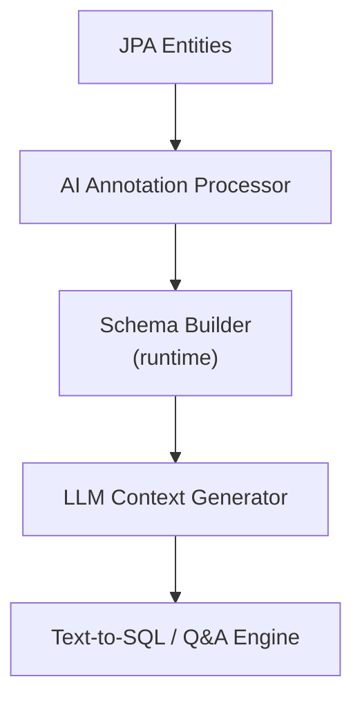

# AI Semantic Schema

[](https://github.com/crystalplanetcode/ai-semantic-schema/actions/workflows/ci.yml)
[](https://github.com/crystalplanetcode/ai-semantic-schema/actions/workflows/publish.yml)
[](LICENSE)

Provides an AI semantic context layer for JPA/Hibernate-based domain models through a set of AI annotations. It helps AI systems understand your data model without manual DDL schema authoring. 

With Spring Boot support out of the box, you can go from JPA entities to AI-ready schema in minutes. Build your data model with Spring Data JPA, transform it into AI schema context with AI Semantic Schema and use it with Spring AI as input for LLM.

AI Semantic Schema transforms JPA/Hibernate metadata together with AI annotations into a structured semantic schema for LLM-powered systems. It captures entity meaning, field semantics, relations, and metrics directly from the domain model and exposes the result as JSON or YAML. In Spring Boot applications, auto-configuration enables immediate integration with minimal setup. It converts your existing domain model into rich semantic context, including human / LLM meaning of tables and fields, relations, and metrics, ready for AI prompts.



Practical useage example: **AI Semantic Schema Demo**: https://github.com/crystalplanetcode/ai-semantic-schema-demo

## Quick Start

Prerequisites:

- Java 17+ (Java 21+ recommended)
- Spring Boot 4.0+ (requires Hibernate 7.x)
- JPA/Hibernate model (entities mapped with `@Entity`)

Minimal dependencies with Spring Data JPA:

```groovy
implementation 'org.springframework.boot:spring-boot-starter-data-jpa'
implementation 'io.github.crystalplanetcode:ai-semantic-schema-spring-boot-starter:0.1.0'
runtimeOnly 'com.h2database:h2'
```

Example properties:
```properties
spring.datasource.url=jdbc:h2:mem:testdb
spring.datasource.driver-class-name=org.h2.Driver
spring.jpa.hibernate.ddl-auto=create-drop
spring.jpa.show-sql=true
```

With Spring Boot starter, auto-configuration creates these beans:

- `HibernateSchemaAIExtractor`
- `AISemanticContextProvider`

Default behavior can be configured with properties:

```properties
ai.semantic.schema.enabled=true
ai.semantic.schema.excludeEntityRelationalFields=false
```

<b>Please note</b>: It is possible to use this library without any AI annotations at all. Doing so, the library will provide raw schema with relationships (DDL quality). However the AI context quality highly increases with proper usage of annotations such as `@AITable`, `@AIField`, `@AIMetric`, and `@AIRelation` (see documentation / examples)

Minimal JPA entity example (simplest form of annotations):

```java
@Entity
@Table(name = "orders")
@AITable("Represents a commercial transaction initiated by a customer")
public class Order {

	@Id
	@AIField("Unique identifier of the order within the system")
	private Long id;

	@AIField("Total financial value of the order, including all items and applicable charges")
	private BigDecimal totalAmount;
}

@Entity
@Table(name = "customers")
@AITable("Represents an individual or organization that purchases goods or services")
public class Customer {

	@Id
	@AIField("Unique identifier of the customer")
	private Long id;

	@AIField("Full name or business name of the customer")
	private String name;

	@AIField("Primary physical or mailing address of the customer")
	private String address;
}
```

Example usage with `@Autowired`:

```java
@Component
public class SemanticContextFacade {

	@Autowired
	private AISemanticContextProvider aiSemanticContextProvider;

	public AISemanticContext buildContext() {
		return aiSemanticContextProvider.buildContext(Order.class, Customer.class);
	}
}
```

Example usage with Spring bean:

```java
@Service
public class SemanticContextService {

	private final AISemanticContextProvider aiSemanticContextProvider;

	public SemanticContextService(AISemanticContextProvider aiSemanticContextProvider) {
		this.aiSemanticContextProvider = aiSemanticContextProvider;
	}

	public AISemanticContext buildContext() {
		return aiSemanticContextProvider.buildContext(Order.class, Customer.class);
	}
}
```

## Modules

- ai-semantic-schema-core: model + serializers.
- ai-semantic-schema-hibernate: Hibernate extractor + AISemanticContextProvider.
- ai-semantic-schema-spring-boot-starter: Spring Boot auto-configuration.

## Build

```bash
./gradlew build
```

## Maven Central (Not yet there)

Artifacts will be published under:

- Group: io.github.crystalplanetcode
- Version: 0.1.0

## Maven Local (Current state)

You can use this library in your project by publishing it to mavenLocal first:

```bash
./gradlew clean publishToMavenLocal
```

add dependency to your project along with mavenLocal:

if using gradle, modify: <b>build.gradle</b> of your project, adding <b>mavenLocal()</b>:
```
repositories {
	mavenLocal()
	mavenCentral()
}
```

if using maven you can skip this step, since mavenLocal will be included anyway.

## Dependencies (the same regardless if mavenLocal or mavenCentral)

### Gradle

```groovy
implementation 'io.github.crystalplanetcode:ai-semantic-schema-core:0.1.0'
implementation 'io.github.crystalplanetcode:ai-semantic-schema-hibernate:0.1.0'
implementation 'io.github.crystalplanetcode:ai-semantic-schema-spring-boot-starter:0.1.0'
```

### Maven

```xml
<dependency>
<groupId>io.github.crystalplanetcode</groupId>
<artifactId>ai-semantic-schema-core</artifactId>
<version>0.1.0</version>
</dependency>

<dependency>
<groupId>io.github.crystalplanetcode</groupId>
<artifactId>ai-semantic-schema-hibernate</artifactId>
<version>0.1.0</version>
</dependency>

<dependency>
<groupId>io.github.crystalplanetcode</groupId>
<artifactId>ai-semantic-schema-spring-boot-starter</artifactId>
<version>0.1.0</version>
</dependency>
```
## License

Licensed under the Apache License, Version 2.0. See the LICENSE and NOTICE files in the project root.

## Project Policies

- [Contributing](CONTRIBUTING.md)
- [Security](SECURITY.md)
- [Changelog](CHANGELOG.md)

## Author
**AI Semantic Schema** — Marcin Nowicki [Crystal Planet Code]
